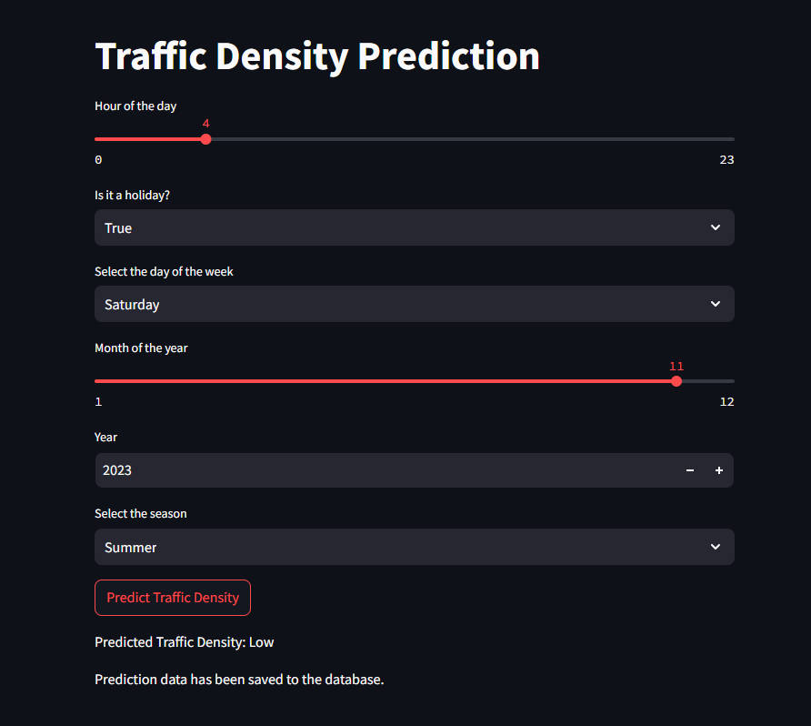
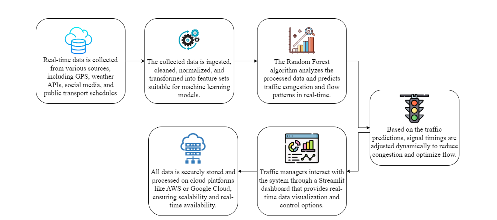

# Real-Time Traffic Prediction and Optimization System 🚦

This repository contains the implementation of a **Real-Time Traffic Prediction and Optimization System** using advanced Machine Learning algorithms, cloud infrastructure, and multi-modal data integration. The system aims to enhance urban traffic management by predicting congestion, optimizing traffic signal timings, and suggesting alternate routes, ensuring smoother traffic flow and reduced congestion.


---

## 🛠️ Features

- **Real-Time Traffic Prediction**: Uses Random Forest and other ML models for accurate traffic predictions based on GPS, weather, and social data.

- **Dynamic Signal Adjustments**: Automatically adapts traffic signal timings in real time.
- **Cloud Integration**: Scalable storage and processing for handling large datasets.
- **User-Friendly Dashboard**: Interactive interface for real-time monitoring and manual overrides.
- **Multi-Modal Data Sources**: Integration with APIs like [GraphHopper](https://graphhopper.com/dashboard/#/apikeys) and [Meteomatics Weather API](https://www.meteomatics.com/en/weather-api/).

---

## 📁 Repository Structure

| File/Directory               | Description                                                                                     |
|------------------------------|-------------------------------------------------------------------------------------------------|
| `try.ipynb`                  | Jupyter Notebook for exploratory data analysis and initial model experiments.                  |
| `Automaic_Traffic_Prediction.py` | Python script for real-time traffic prediction implementation.                              |
| `final_model.pkl`            | Final trained model for traffic predictions.                                                  |
| `traffic_prediction_model.pkl` | Backup model for predictions.                                                               |
| `scaler.pkl`                 | Pre-trained scaler used for data normalization.                                               |
| `traffic.csv`                | Dataset containing raw traffic data.                                                          |
| `traffic_features_and_target.csv` | Pre-processed dataset with engineered features and target labels.                         |
| `manual_traffic_prediction.py` | Script for manual traffic prediction tasks.                                                 |
| `automaric_display_results.py` | Automated results display for predictions and analytics.                                     |
| `manual_display_results.py`  | Manual display of results for validation and operator usage.                                  |

---

## 🌟 System Architecture


1. **Data Collection**: Collects real-time data from APIs and sensors (traffic, weather, GPS).
2. **Preprocessing**: Data cleaning, normalization, and feature engineering.
3. **Machine Learning**: Uses Random Forest and additional models for predictions.
4. **Traffic Signal Optimization**: Adapts traffic lights dynamically based on predictions.
5. **Dashboard**: Interactive visualization and control interface for operators.
6. **Cloud Deployment**: Scalable cloud solutions for storage and processing.

---

## 🛠️ Prerequisites

Ensure the following are installed on your system:

- **Python 3.8+**
- Libraries: `pandas`, `numpy`, `scikit-learn`, `flask`, `streamlit`, `matplotlib`, `seaborn`
- Cloud APIs: [GraphHopper API Key](https://graphhopper.com/dashboard/#/apikeys), [Meteomatics Weather API Key](https://www.meteomatics.com/en/weather-api/)

---

## 🚀 Getting Started

### 1. Clone the Repository
```bash
git clone https://github.com/your-username/real-time-traffic-prediction.git
cd real-time-traffic-prediction
```
### 2. Install Dependencies
```bash
pip install -r requirements.txt
```

### 3. Set API Keys
- GRAPH_HOPPER_API_KEY=your_graphhopper_api_key
- METEOMATICS_API_KEY=your_meteomatics_api_key

### 4. Run the Application
- **Jupyter Notebook**:
  ```bash
  jupyter notebook try.ipynb
  ```
- **Traffic Prediction Script**:
  ```bash
  python Automaic_Traffic_Prediction.py
  ```
## 🎨 Dashboard

Run the Streamlit dashboard:
```bash
streamlit run dashboard.py
```
## 🧪 Results and Analysis

- **Accuracy**: Achieved 95% accuracy using the Random Forest model.
- **Real-Time Performance**: Processes predictions and adjusts signals with <1-second latency.

## Documentation 
- For detailed methodology, results, and analysis, see the [Detailed Report](https://github.com/Jaffer74/Real-Time-Traffic-Prediction-and-Optimization-System-/blob/main/Real-Time%20Traffic%20Prediction%20and%20Optimization%20.pdf).
